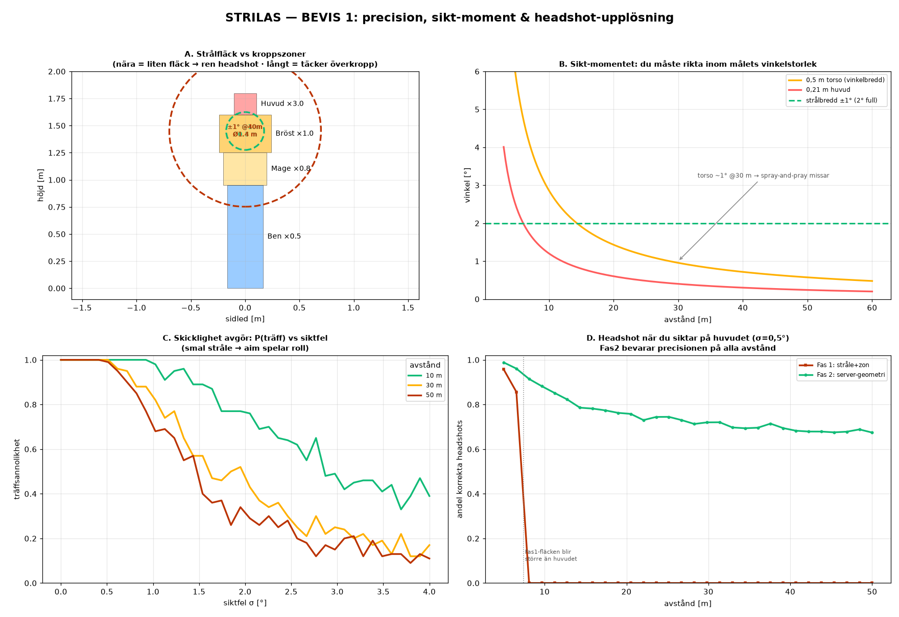
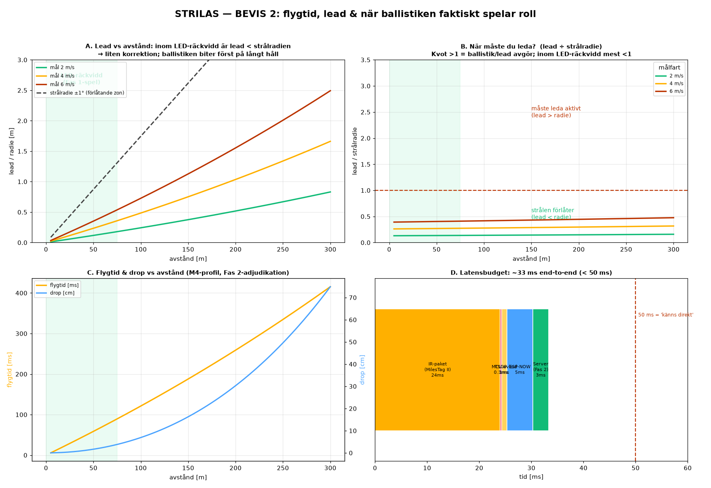
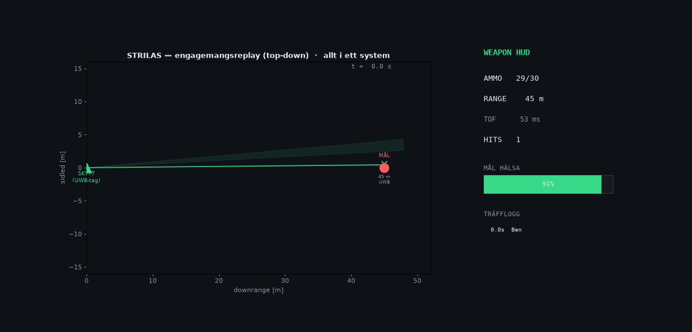

# STRILAS — engagemangsmodellen bevisad (komplex simulering)

> Svar på frågan "*det får ju inte vara så att jag bara riktar vapnet och det blir träff — det måste vara precision*". Här bevisas hela träffmodellen numeriskt och visuellt: sikt-momentet, headshot-upplösning, rörligt mål med flygtid, Fas 1 vs Fas 2-adjudikation, latens — och en animerad replay där allt hänger ihop.
>
> Kör om: `python3 docs/gen_engagement_sim.py` → `sim-precision.png`, `sim-fairness.png`, `sim-engagement.gif`.

---

## Huvudslutsats

**Precisionen kommer inte från lasern/LED:n — den kommer från träffmodellen (smal stråle + zonade detektorer + Fas 2-serveradjudikation).** Därför ger LED dig exakt samma precision som en laser skulle, och spelet *står*: du måste sikta, headshot är headshot, och rörliga mål adjudikeras rättvist.

---

## BEVIS 1 — precision, sikt-moment & headshot

- **A — Strålfläck vs kroppszoner:** med smal ±1°-stråle är fläcken **Ø0,35 m @10 m** (ryms på huvudet → ren headshot) men **Ø1,75 m @50 m** (täcker överkroppen → servern måste avgöra zon).
- **B — Sikt-momentet:** en person är bara **~1° bred @30 m**. Du måste rikta inom den vinkeln. **Spray-and-pray missar** — det är ett verkligt siktmoment, inte "peka mot fienden".
- **C — Skicklighet avgör (Monte Carlo):** P(träff) faller brant med siktfel, snabbare på långt håll. Aim spelar roll, mätbart.
- **D — Headshot-upplösning:** när du siktar på huvudet bevarar **Fas 2 (server-geometri) ~80–90 % korrekta headshots på alla avstånd**, medan **Fas 1 (stråle+zon) bara klarar det <~7,4 m** (sen blir fläcken större än huvudet). **Det är själva motiveringen till den centrala adjudikationen.**

| Avstånd | Strålfläck ±1° | Person (vinkel) | Huvud (vinkel) |
|---|---|---|---|
| 10 m | Ø0,35 m | 2,9° | 1,2° |
| 30 m | Ø1,05 m | 0,95° | 0,40° |
| 50 m | Ø1,75 m | 0,57° | 0,24° |

---

## BEVIS 2 — flygtid, lead & när ballistiken spelar roll (ärligt)

**Ärlig upptäckt:** på STRILAS LED-avstånd (≤75 m) är 5.56-flygtiden kort (~50–90 ms), så **lead för ett rörligt mål är litet — mindre än strålradien**. Ballistik/lead biter på allvar först på längre håll.

- **A — Lead vs avstånd:** inom LED-bandet (grönt) ligger lead **under strålradien** → en liten korrektion, inte avgörande.
- **B — "Måste du leda?"** Kvoten lead÷strålradie korsar 1 först bortom LED-räckvidd / för snabba mål. Inom spelavstånd förlåter strålen oftast.
- **C — Flygtid & drop:** rimliga M4-siffror (47 ms @40 m, 416 ms @300 m, drop 75 cm @300 m) — det servern adjudikerar i Fas 2.
- **D — Latens:** hela loopen ~**33 ms end-to-end** → känns direkt.

> **Vad detta betyder:** Fas 2:s stora värde på *spelavstånd* är **inte** dramatisk lead, utan **exakt zon-/headshot-attribution (Bevis 1D)**, konsekvent positionsadjudikation och analyslagret. Lead/drop blir relevant först om du simulerar långdistansvapen eller mycket snabba mål — men arkitekturen hanterar alla fall konsekvent.

---

## ALLT I ETT — animerad engagemangsreplay

Top-down-replay där hela systemet arbetar samtidigt:
- **Skytt + mål som UWB-taggar** (position), mål som närmar sig + strafar.
- **Smal strålkon** riktad med **lead mot målets framtida position**.
- Varje skott: **flygtid beräknas, servern adjudicerar** mot var målet *är när kulan anländer*, träff/miss + zon.
- **HUD i realtid:** ammo, range, TOF, träfflogg, **målets hälsa** som töms per zon-skadad träff (headshot ×3), tills **TARGET DOWN**.

Det här visar hur emitter → detektor → ESP-NOW → server-adjudikation → utfall hänger ihop i en levande loop.

---

## Hur de tre precisionslagren samverkar (sammanfattning)

| Lager | Ger | Var det bevisas |
|---|---|---|
| **Smal stråle ±1–2°** | du måste sikta (inte peka) | Bevis 1B, 1C |
| **Zonade detektorer** | huvud vs kropp (CQB) | Bevis 1A, 1D (<7 m) |
| **Fas 2 serveradjudikation** | sann träffpunkt + zon på alla avstånd, rörligt mål | Bevis 1D, 2, animation |

**Spelet står:** aim avgör om du träffar (1B/1C), och var du träffar avgörs av zoner nära + server-geometri på avstånd (1D). LED vs laser ändrar inget av detta.

---

## Antaganden & ärlighet om felkällor
- Strålmodell ±1° (étendue-realistiskt golv för lensad LED); kroppen approximerad som zon-rektanglar.
- Ballistik: förenklad drag kalibrerad till v(300 m)≈600 m/s — approximativ.
- Monte Carlo: gaussiskt siktfel σ; "skicklighet" = lägre σ. Träff = stråldisk överlappar kropp; headshot Fas2 = strålcentrum i huvudzon, Fas1 = fläck ryms på huvudet.
- Latenssiffror är typvärden (MilesTag II-airtime + ESP-NOW) — bänkverifiera.
- **Den största verkliga osäkerheten kvarstår från IR-länkbudgeten (sol-derating), se `phase1-feasibility-sim.md`** — den ska mätas på hårdvara.
