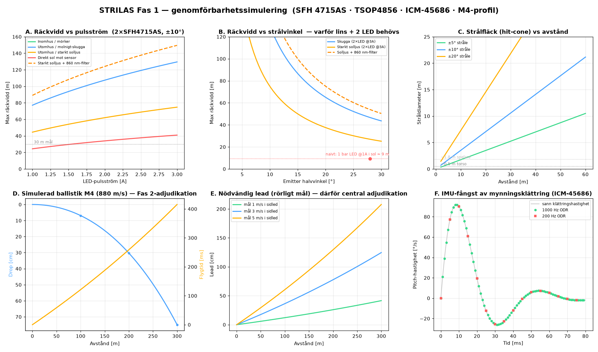

# STRILAS Fas 1 — genomförbarhetssimulering

> Fysiksimulering med den **valda hårdvaran** (SFH 4715AS-emitter, TSOP4856-detektor, ICM-45686-IMU, M4-ballistikprofil) för att verifiera att kedjan går ihop: IR-räckvidd, strålgeometri, ballistik, IMU-fångst och latens. Kör om med `python3 docs/gen_sim.py`.
>
> ⚠️ **Läs detta som en länkbudget med felmarginaler, inte exakta löften.** Den största osäkerheten är hur mycket solljus desensibiliserar TSOP:ens AGC (multiplikatorn nedan) — den **ska bänkverifieras** innan man låser emitter-effekt.

---

## Kort svar på din tvivel: **du har rätt — och fel, beroende på design**

| Emitter-design | Räckvidd i **starkt solljus** |
|---|---|
| **Naivt:** 1 bar LED @1A, ingen lins (±45°) | **~9 m** ❌ — precis din magkänsla |
| **STRILAS-design:** 2×SFH4715AS @3A puls, lins ±10° | **~40–75 m** ✅ |
| samma + 860 nm optiskt bandpass på TSOP | **~80–150 m** |

Din skepsis stämmer **för naiv användning** — en vanlig IR-LED i sol når bara några meter (TSOP:ens AGC strypar och solbruset dränker bärvågen). Men budgeten **stänger till tiotals meter** när tre saker görs rätt samtidigt: **(1) pulsa LED:n hårt (3 A, inte 100 mA)**, **(2) lensa strålen smal (±10°)**, **(3) använd 2 LED**. TSOP:ens 56 kHz-bandpass + AGC gör resten av soljobbet.

> **Konservativ designmålsättning:** planera för **~20–40 m i bjärt sol** (den hårda "direkt sol mot sensor"-raden ger 41 m). Behöver du mer → lägg på 860 nm-filter, fler LED, eller smalare stråle.

---

## Panel för panel

### A & B — IR-länkbudget (det du tvivlade på)
- Räckvidden skalar med **√(emitter-intensitet / TSOP-tröskel)**. Tröskeln stiger ~10× i skugga, ~30× i sol, ~100× med sol rakt på sensorn (AGC-desens).
- **Pulsström är gratis räckvidd:** TSAL-/SFH-LED tål ~3 A i korta pulser (<0.5 % duty) trots 100 mA kont. — det är precis vad MilesTag-bärvågen gör. 1→3 A ≈ +70 % räckvidd.
- **Smal stråle = mer räckvidd:** ±10° koncentrerar samma flux → längre. Panel B visar att till och med ±20° i sol klarar ~30 m med 2×LED@3A.
- **860 nm bandpass-filter** på TSOP ungefär fördubblar sol-räckvidden (skär bort solens bredbands-NIR).

### C — Strålfläck (hit-cone)
- ±10°-stråle ger ~10 m fläck vid 30 m → **mycket förlåtande** (lätt att träffa), men kan spilla på närstående.
- För ett "gevär som kräver sikte" → smalare ±3–5°. Avvägning: smalare = precis + längre räckvidd, men kräver fler TSOP på målet (varför hjälm-halo + torso-zoner finns).
- **Rekommendation:** börja ±10° (snäll i CQB), trimma mot ±5° för fält/precision.

### D — Ballistik (Fas 2-adjudikation, sanity check)
| Avstånd | Flygtid | Drop | Restfart |
|---|---|---|---|
| 50 m | 59 ms | 1.7 cm | 826 m/s |
| 100 m | 121 ms | 6.9 cm | 774 m/s |
| 200 m | 259 ms | 30 cm | 682 m/s |
| 300 m | 416 ms | 75 cm | 600 m/s |

Siffrorna är rimliga för 5.56. **I Fas 1 spelar de ingen roll** (direkt strålträff). I Fas 2 är det dessa flygtider servern adjudikerar — och de motiverar varför.

### E — Lead för rörligt mål → varför central adjudikation
Ett mål som rör sig 3 m/s i sidled hinner flytta sig **36 cm @100 m, 78 cm @200 m, 125 cm @300 m** under kulans flygtid. En lokal "strålen träffar = träff" kan inte vara rättvis på avstånd mot rörliga mål — **det är hela poängen med Fas 2:s positionsbaserade adjudikation.** Bekräftar arkitekturen.

### F — IMU-fångst av mynningsklättring (varför ICM-45686, inte serieport-IMU)
- Rekylcykeln ~40 ms, peak pitch-rate ~90°/s, klättring ~1.3°/skott.
- **@1 kHz (ICM-45686 SPI): ~40 sampel/cykel** → impulsen väl upplöst. ✅
- **@200 Hz (serieport-IMU typ Waveshare/IWT603-stream): ~8 sampel** → grovt. ❌
- Bekräftar beslutet: rå SPI-sensor på vapnet, serieport-IMU bara till kropps-pose i Fas 2.
- **Obekämpad full-auto:** ~1.3°/skott → vid 30 m vandrar varje skott **~67 cm uppåt** (borrlinjerad stråle) → serien går av målet av sig själv. Recoil-to-aim "gratis" i Fas 1 bekräftad.

### Latensbudget — loopen stänger
MilesTag II skott-airtime ~24 ms + TSOP-demod ~0.3 ms + ESP-NOW ~1–10 ms ≈ **~32 ms** end-to-end → **< 50 ms, känns direkt.** ✅

---

## Slutsats: går det ihop?

**Ja — med villkor.** Hela kedjan stänger:

| Delsystem | Verdikt |
|---|---|
| **IR-räckvidd i sol** | ✅ tiotals meter — **men kräver 2×LED @3 A puls + lins + ev. 860 nm-filter.** Naiv LED = ~9 m (din tvivel bekräftad). **Bänkverifiera sol-derating.** |
| **Strålgeometri** | ✅ ±5–10° balanserar räckvidd/precision/täckning |
| **Ballistik** | ✅ rimliga flygtider; motiverar Fas 2-adjudikation |
| **IMU** | ✅ ICM-45686 @1 kHz fångar rekylimpulsen; serieport-IMU gör det inte |
| **Latens** | ✅ ~32 ms, känns direkt |

**Designkonsekvenser att föra in i Fas 1:**
1. **Emittern måste vara 2×SFH4715AS, pulsad ~3 A, lensad ±5–10°** — inte en enkel LED. (R_limit sätter både räckvidd och Class 1-tak.)
2. **Reservera plats för 860 nm-bandpassfilter** över TSOP-zonerna om utomhus-sol blir problem.
3. **Bänktesta sol-derating tidigt** (steg 1) — mät verklig räckvidd mot en TSOP i direkt sol innan emitter-effekten låses.

---

## Antaganden & felkällor (var ärlig mot dem)
- TSOP4856-tröskel ~0.35 mW/m² (lab); sol-multiplikatorerna (10–100×) är **uppskattningar** — den enskilt största osäkerheten. Bänkmätning krävs.
- Emitter: 0.9 W/sr @1 A bar, lins-effektivitet 0.6, mild sublinjär strömskalning. Verklig lins/étendue kan ge mindre vinst vid mycket smala vinklar.
- Ballistik: förenklad drag-modell kalibrerad till v(300 m)≈600 m/s — approximativ G7, ej exakt.
- IMU-klättring: parametrisk modell (~90°/s peak) — verifiera mot verklig rekylenhet.
