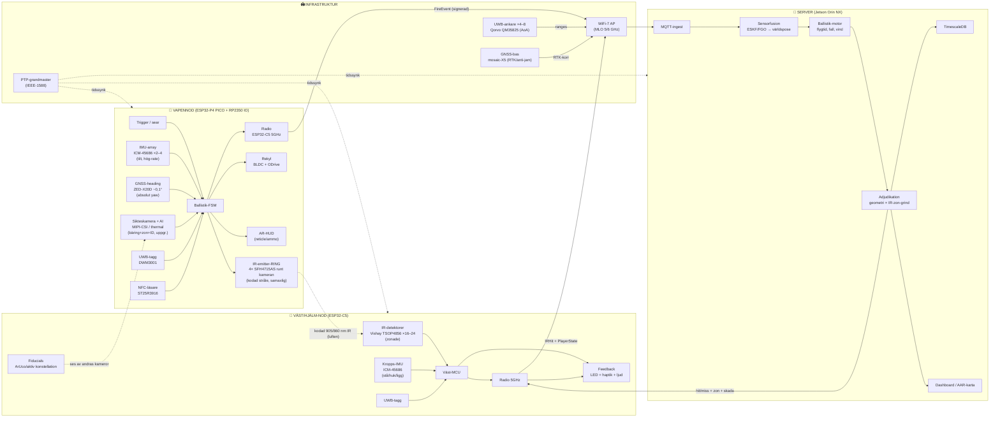
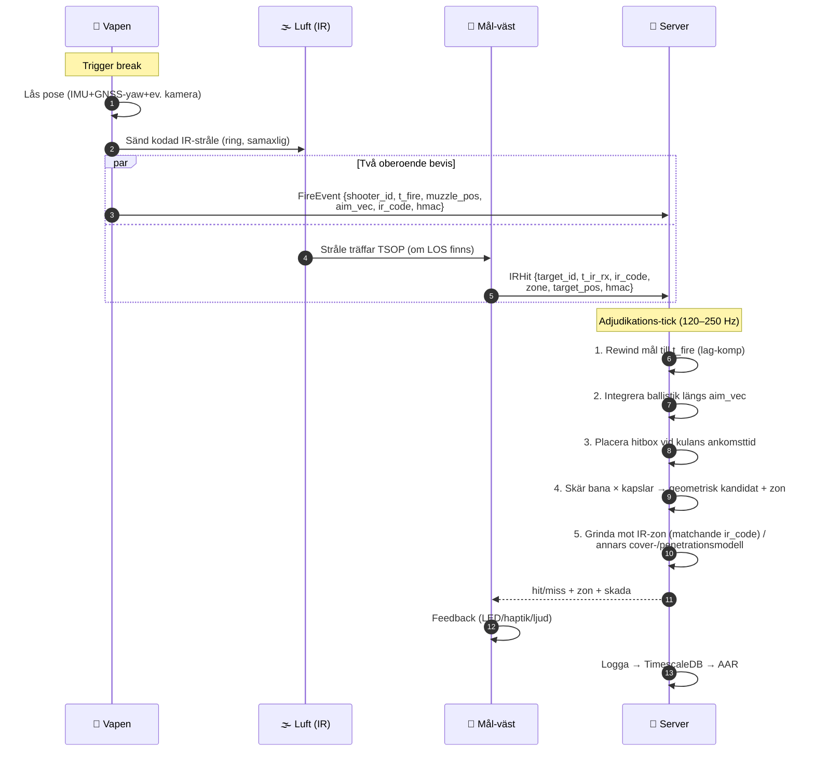
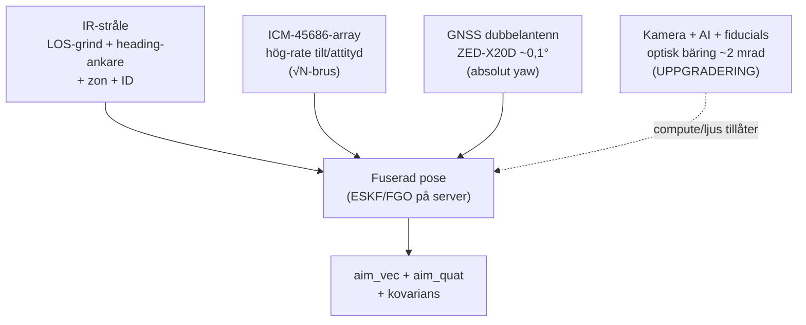
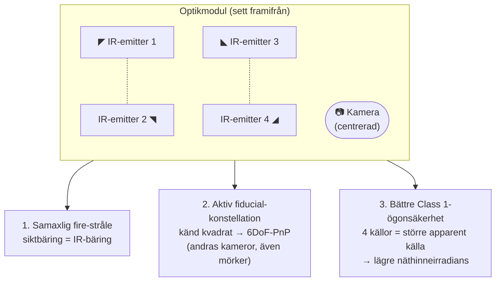

# STRILAS — Systemflödesschema (hur allt hänger ihop)

> Visuell karta över nivå-3-systemet: vilka komponenter som sitter var, hur data
> flödar mellan dem, och vad som händer från trigger till "du är träffad".
> Kompletterar [`level3-ballistic-architecture.md`](level3-ballistic-architecture.md)
> (texten) och [`hardware-analysis.md`](hardware-analysis.md) (delarna/BOM).

---

## 1. Komponentkarta — vem pratar med vem

Tre domäner: **vapennod** och **väst/hjälm-nod** på spelaren, **infrastruktur** i
arenan, och en **server** som ensam avgör träff. Allt sensordata flödar till servern;
bara feedback flödar tillbaka.

**Läsregel:** heldragna pilar = data/nätverk. Prickade pilar = optik/IR genom luften
eller tidssynk. **IR-strålen** är den enda fysiska länken mellan skytt och mål — den
är "siktlinje-sanningen" som grindar geometrin.

---

## 2. Skottsekvens — från trigger till "träffad"

Det här är den heta loopen. Notera att **kulans flygtid modelleras** (mäts inte), och
att **servern ensam** avgör — vapnet och västen skickar bara signerade bevis.

**Varför två bevis?** Geometrin (FireEvent + poser) avgör *om kulan anländer, varifrån,
hur hårt*. IR-zonen (IRHit) avgör *var på kroppen* och bevisar **siktlinje** — geometri
ensam kan inte se en vägg emellan. Servern kombinerar dem (steg 5).

---

## 3. Pose-fusion — de fyra lagren som bygger siktriktningen

Vapnets siktriktning är systemets nyckelgräns. Den byggs i lager (beslut: **fuserad**):

| Lager | Ger | Svaghet som täcks av andra | Status |
|---|---|---|---|
| IR-stråle | LOS-sanning, grov bäring, ID | grov vinkel → IMU/kamera förfinar | **nu** |
| IMU-array | hög-rate, låg latens | driver → GNSS/kamera binder | **nu** |
| GNSS-heading | absolut yaw (ingen drift, ingen magnetometer) | bara ute, ~Hz-rate → IMU broar | **nu (ute)** |
| Kamera + AI | skarp bäring + zon + ID | mörker (→ thermal), compute | **uppgradering** |

---

## emitter-ring — 4 IR-emittrar i kvadrat runt kameran

Din fråga: **ja**, och det är ett elegant val. Layouten löser tre saker samtidigt:

**Varför fungerar det:**

1. **Samaxlighet (boresight).** Med kameran i mitten och strålen runt om sammanfaller
   den optiska axeln med IR-axeln. Det kameran/AI:n pekar på = dit kodad IR går. Det
   gör kamera-bäring och IR-träff till *samma* riktning — ingen parallax att kalibrera bort.
2. **Aktiv fiducial.** Fyra emittrar med *känt* kvadratavstånd (t.ex. 40–60 mm) är ett
   plant PnP-mål. En observerande kamera (annan spelare/arena) kan lösa full 6DoF-pose
   på vapnet — och eftersom det är aktiv IR funkar det **i mörker**, till skillnad från
   passiva ArUco-tryck. Modulera varje hörn individuellt → ID + roll-orientering (bryter
   kvadratens symmetri-tvetydighet).
3. **Ögonsäkerhet.** Att sprida emissionen över 4 källor i en kvadrat **ökar den apparenta
   källstorleken**. Under IEC 60825-1 har en utsträckt källa högre tillåten exponering →
   *lättare* att nå Class 1 än en enda punktkälla med samma totaleffekt. (Total tillgänglig
   energi måste fortfarande bänkmätas; C5-derating gäller pulståget.)

**Praktiska designregler:**

- Håll emittrarna **strax utanför kamerans FOV-kon** med en liten skärm/baffel så IR inte
  blöder in i linsen (bloom/flare i bilden).
- Vinkla dem lätt framåt så strålkonerna överlappar på engagemangsavstånd → jämn irradians,
  tolerans mot delvis skymd emitter (redundans 4→ funkar även om 1 skyms).
- Samma bärvåg (38/40/56 kHz) och våglängd som resten av systemet; individuellt adresserbara
  hörn för rikare ID/roll-kodning.

---

## Relaterade dokument

- [`level3-ballistic-architecture.md`](level3-ballistic-architecture.md) — arkitektur i text (geometri + IR-ankare + fuserad pose)
- [`hardware-analysis.md`](hardware-analysis.md) — komponentval + nivå-3-BOM
- [`phase1-build.md`](phase1-build.md) · [`phase1-engagement-sim.md`](phase1-engagement-sim.md) — Fas 1
- [`../sim/`](../sim/) — interaktiv 3D-simulator
