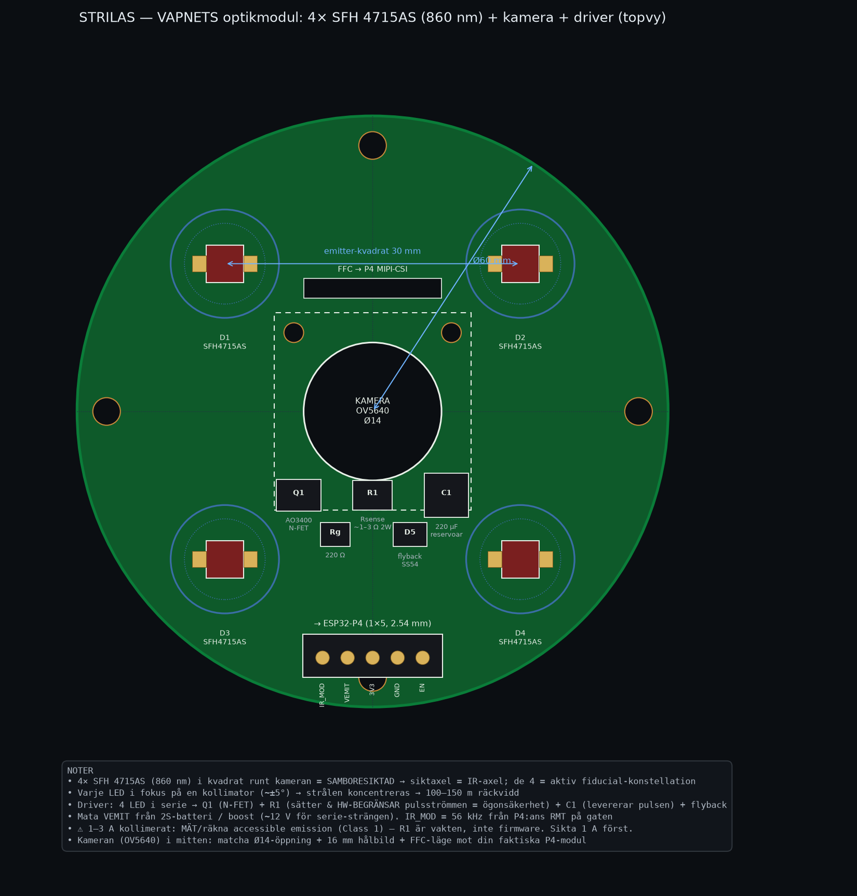
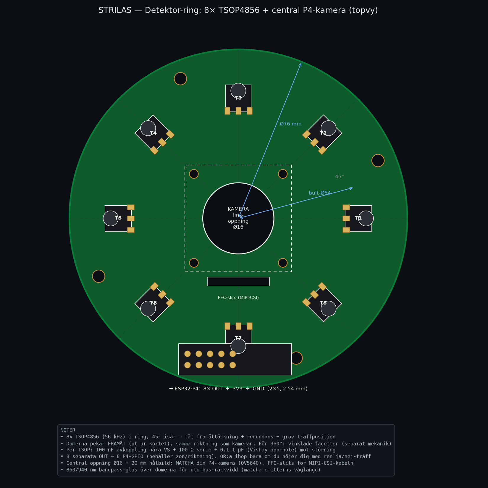

# STRILAS — Hårdvaruritningar

Två fysiskt skilda noder, två kort:

| Kort | Nod | Funktion |
|---|---|---|
| **Vapnets optikmodul** | vapen | IR-**sändare** (860 nm) + kamera + driver |
| Detektor-ring | mål/väst | IR-**mottagare** (TSOP4856) + kamera |

---

## 1. Vapnets optikmodul — 4× SFH 4715AS (860 nm) + kamera + driver

Allt vapnet behöver för att **skjuta kodad IR + se målet**, på ett kort. Genereras av
[`weapon_emitter_layout.py`](weapon_emitter_layout.py).

**Kärnan — samboresiktad ring:** 4 emittrar i kvadrat **runt kameran** → siktaxel =
IR-axel (det kameran pekar på = dit IR går), och de 4 utgör samtidigt en **aktiv
fiducial-konstellation** som andra kameror kan pose:a på (även i mörker).

### Vad som sitter på kortet

| Ref | Del | Roll |
|---|---|---|
| D1–D4 | **ams-OSRAM SFH 4715AS** (860 nm) ×4 | skott-emitter, i kvadrat runt kameran |
| — | **kollimator-lins ~±5°** ×4 (Carclo/LEDiL) | koncentrerar strålen → 100–150 m |
| (mitten) | **P4-kamera (OV5640, MIPI-CSI)** | sikte / pose / fiducial-läsning |
| Q1 | **AO3400 N-FET** | switchar emitter-strängen på 56 kHz |
| R1 | **Rsense ~1–3 Ω 2 W** | **sätter & HW-begränsar pulsströmmen = ögonsäkerhet** |
| C1 | **220 µF reservoar** | levererar pulsströmmen |
| Rg / D5 | 220 Ω gate / SS54 flyback | ren switchning + induktiv retur |
| J1 | **1×5: IR_MOD, VEMIT, 3V3, GND, EN** | mot ESP32-P4 |

### Mått & el

- Kort **Ø60 mm**, emitter-kvadrat **30 mm**, central lins-öppning **Ø14**, kamera-hålbild **16 mm**, 4× M2.5.
- **4 LED i serie** → samma ström genom alla; mata **VEMIT** från 2S-batteri / boost (~12 V för strängen).
- **IR_MOD** = 56 kHz från P4:ans RMT på gaten.

### ⚠️ Ögonsäkerhet (1–3 A kollimerat)

Inte trivialt Class 1 längre. **R1 är hårdvaru-strömgränsen** (inte firmware). Räkna/mät
accessible emission per IEC 60825-1, **sikta 1 A först** och köp räckvidd med mottagar-filtret
hellre än med mer ström.

### ⚠️ Verifiera kameran

Ø14-öppning + 16 mm-hålbild + FFC-läge är **riktmått** — mät din faktiska P4-kamera (OV5640)
och uppdatera `CAM_LENS / CAM_SQ / CAM_HOLE` i skriptet (parametriskt, en rad var).

---

## 2. Detektor-ring (MÅLSIDAN) — 8× TSOP4856 + kamera

**Målets/västens** mottagarmodul (du skjuter MOT den) — 8 IR-mottagare i ring runt en
kamera. Genereras av [`detector_ring_layout.py`](detector_ring_layout.py). Separat nod
från vapnet; specen för mått/avkoppling/360°-täckning står i skriptets noter.

> Den här hör hemma på målet/västen, inte på vapnet — vapnet **sänder** (kort 1),
> målet **tar emot** (kort 2).

---

## Nästa steg mot riktig PCB

Dessa ritningar → KiCad: SFH 4715AS- + TSOP4856- + kameramodul-footprints, dragning till
header. Säg till så genererar jag KiCad-footprintsen och ett schema.
