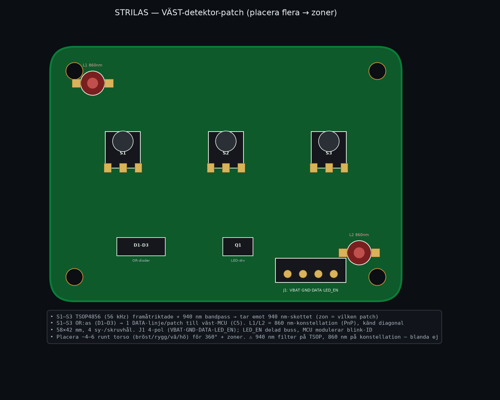
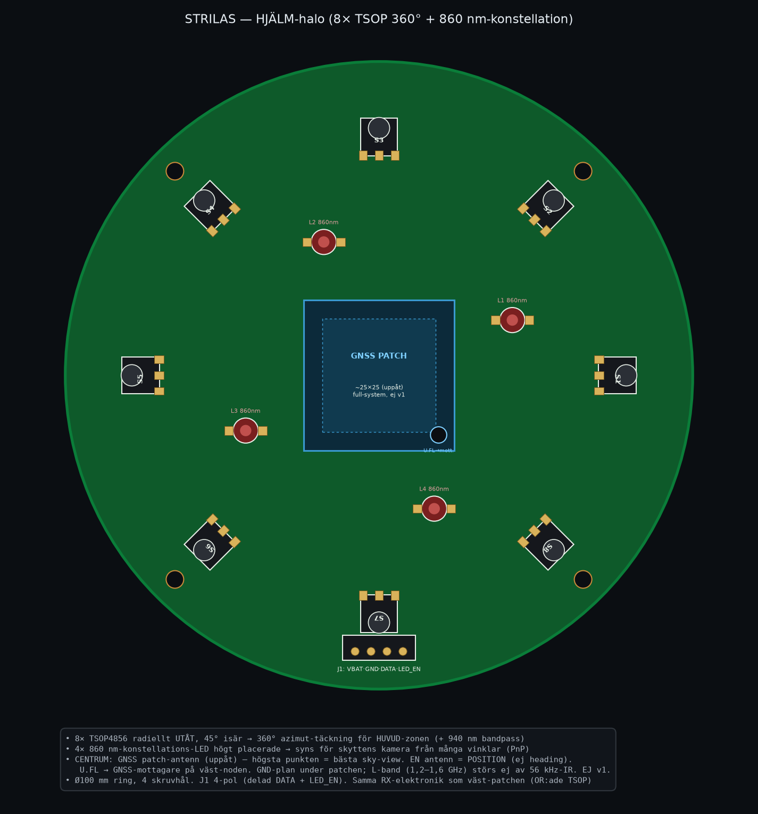

# STRILAS — Receiver-/player-kort (väst + hjälm)

Player-sidan. **Ingen kamera** (det är skytten som ser dig). Varje kort gör två saker:

- **Tar emot skott:** Vishay **TSOP4856** (56 kHz) + **940 nm bandpass** — skottstrålen är 940 nm.
- **Syns för skyttens kamera:** **860 nm IR-konstellations-LED** i känd geometri → PnP-bäring.

Genereras av [`receiver_boards_layout.py`](receiver_boards_layout.py). Två kort:

## 1. Väst-detektor-patch (placera 10 → zoner)

- **44×44 mm** (fyrfaldigt symmetrisk), 4 skruvhål. **U1–U4 TSOP4856** i diamant, var böjd ~40° utåt
  (99,5 % framåt-hemisfär, funkar i valfri vridning) + **konstellation: 2 fasta 860 nm OSLON (D8/D9)
  + 4 böjbara LED-tabbar (D1–D4)** = **6 LED** i känd geometri.
- U1–U4 **OR:as** (BAT54-dioder D5–D7 + en till) → **1 DATA-linje per patch** till väst-noden (ESP32-P4).
  Zon = vilken patch som fyrar.
- **J1 5-pol:** `VBAT · GND · DATA · LED_EN · +3V3`. +3V3 kommer FRÅN moderkortet (matar TSOP, abs-max
  6 V → tål ej 2S direkt); LED-konstellationen drivs på **VBAT** via N-FET (AO3400, LED_EN-grind), i
  **3 seriepar-grenar** (2 LED + 10R 2512/gren). LED_EN delad buss; noden modulerar blink-ID.
- **10 patchar runt torso** (bröst / rygg / vä / hö) → 360° + zoner. (Vibratorn matas separat via zon-kontaktens VIB-stift.)

## 2. Hjälm-halo (360° + huvud-zon + GNSS)

- **Ø100 mm ring**, 4 skruvhål. **8× TSOP4856 radiellt utåt** (45°) → 360° azimut för **huvud-zonen**.
- **4× 860 nm**-konstellation högt placerade → syns för skyttens kamera från många vinklar.
- **CENTRUM: GNSS patch-antenn (uppåt)** — hjälmen är högsta punkten = bästa sky-view.
  - **En** antenn = **position** (heading är vapnets dubbelantenn-jobb, separat).
  - U.FL → GNSS-mottagare på väst-noden. GND-plan under patchen. L-band (1,2–1,6 GHz) störs ej av 56 kHz-IR.
  - **Full-system, ej v1-aktiv** — footprint nu, bestyckas senare.

## Våglängdsplan (måste hållas)

| Funktion | Våglängd | På kortet |
|---|---|---|
| Ta emot skott | **940 nm** | TSOP4856 + 940 nm bandpass |
| Synas (konstellation) | **860 nm** | 860 nm-LED |

⚠️ Blanda inte filtren: 940 nm på TSOP, 860 nm på konstellationen.

## Inkoppling (samma för båda)

Varje patch → **5-pol** kabel till **väst-noden (ESP32-P4)**: `VBAT · GND · DATA · LED_EN · +3V3`
(zon-kontakten på moderkortet är 6-pol, med extra **VIB**-stift för zonvibratorn). DATA = patchens
OR:ade TSOP-utgång (noden avkodar MilesTag + vet vilken patch = zon). LED_EN = delad; noden blinkar
konstellationen (frame-synk för skyttens kamera + ID).

## Användning i testet (v1)

Receiver-korten **är** måltavlan: ett kort (eller en patch på ställning/väst) registrerar
skottet (TSOP → ljud/log) **och** lyser med 860 nm-konstellationen så skyttens kamera kan
PnP:a bäringen. GNSS-patchen är vilande i v1 (position mäts med måttband).

## Att verifiera (mätpunkter)

- TSOP-räckvidd @150 m i sol (940 nm bandpass-vinst) — bänk/fält.
- Konstellations-LED-effekt/modulering för kamera-detektion @150 m dag.
- Zon-granularitet (antal patchar) vs önskad upplösning.

---

> **Föråldrad:** `detector-ring-8x-tsop4856.png` (8 TSOP med **kamera** i mitten) var en tidig
> felaktig player-design — player har ingen kamera. **Ersatt av** väst-patch + hjälm-halo ovan.
